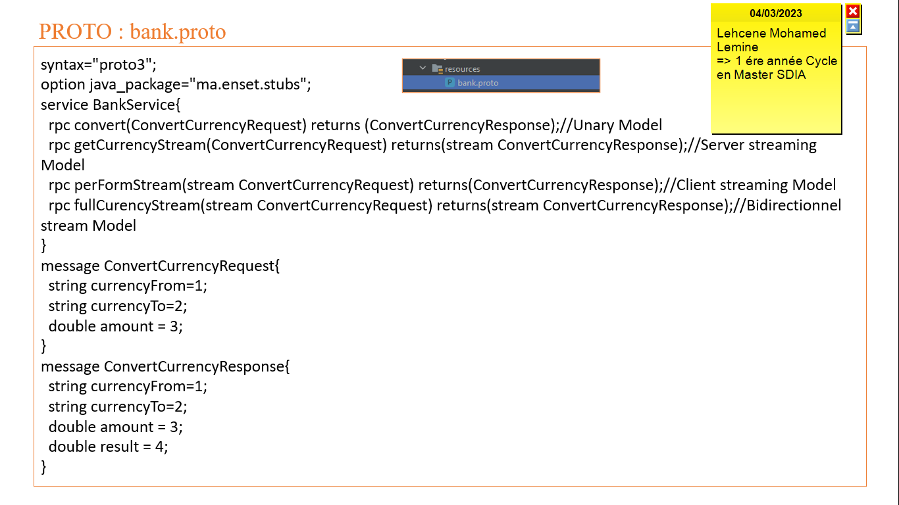
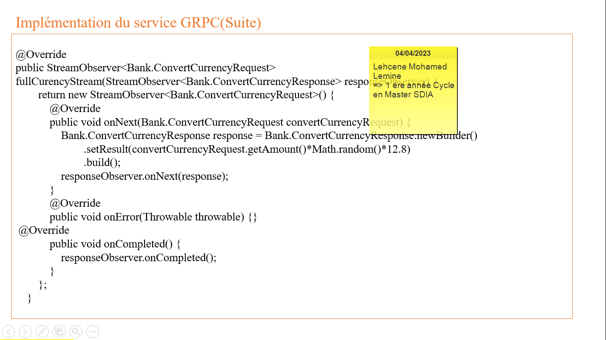

<h2>Compte rendu pour réaliser en tp concerne sur Systèmes Distribués avec GRPC</h2>
<h3>Partie 1 : Implémentations les 4 Modéls :
<ul>
    <li>Unary Model</li>
    <li>Server Sreaming Model</li>
    <li>Client Streaming Model</li>
    <li>BiDirectional Streaming Model</li>
</ul>

